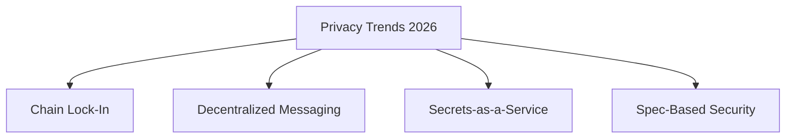

# 17 Things We're Excited About for Crypto in 2026

**Published:** December 11, 2025
**Authors:** a16z crypto partners including Ali Yahya, Arianna Simpson, Miles Jennings, Scott Duke Kominers
**Category:** Trends & Predictions
**Tags:** Crypto Trends, 2026, Stablecoins, AI, Privacy, DeFi

---

## Overview

This annual "Big Ideas" article from Andreessen Horowitz's crypto team outlines emerging trends across five categories for 2026.

---

## Category 1: Stablecoins, RWA Tokenization & Finance

### Stablecoin Growth Statistics

| Metric | Value | Comparison |
|--------|-------|------------|
| Transaction Volume (2025) | $46 Trillion | - |
| vs PayPal | 20x higher | - |
| vs Visa | ~90% | Approaching parity |

### Key Developments

1. **Enhanced On/Offramps**
   - New startups building better connections to traditional payment systems
   - Local currency integration improving
   - QR code-based payment solutions

2. **Bank Ledger Innovation**
   - Stablecoins enable innovation without rewriting legacy systems
   - No need to modify decades-old mainframe infrastructure

3. **Programmable Payments**
   - Settlement becomes programmable and reactive
   - Agents can transact autonomously

---

## Category 2: AI Agents & Research

### The Agent Economy

#### KYA: Know Your Agent

> "Non-human identities now outnumber human employees **96-to-1**"

The industry needs cryptographically signed credentials linking agents to:
- Principals (owners)
- Constraints (limitations)
- Liability (accountability)

### AI-Assisted Research

| Capability | Impact |
|------------|--------|
| Research Execution | Doctoral-student level |
| Polymath Styles | New research approaches |
| Agent Wrapping | Compound intelligence |

---

## Category 3: Privacy & Security

### Privacy as Competitive Moat

> "Bridging tokens is easy, bridging secrets is hard"

Privacy creates network effects stronger than competing chains.

### Four Privacy Trends

| Trend | Description |
|-------|-------------|
| **Chain Lock-In** | Privacy creates stronger network effects |
| **Decentralized Messaging** | Open protocols eliminate server reliance |
| **Secrets-as-a-Service** | Client-side encryption with decentralized key management |
| **Spec-Based Security** | "Spec is law" replacing "code is law" |

---

## Category 4: Prediction Markets & Applications

### The Evolution

1. **Bigger Markets** - More contracts, more liquidity
2. **Broader Topics** - Beyond elections to everyday outcomes
3. **Smarter Trading** - AI agents identifying signals

### Staked Media

Commentators and creators can now make publicly verifiable commitments by tokenizing their positions, creating auditable track records.

---

## Category 5: Zero-Knowledge Proofs

### Performance Milestones

| Metric | Target |
|--------|--------|
| Overhead | ~10,000X |
| Memory Footprint | Hundreds of MB |
| Application | Verifiable cloud computing |

---

## Video: Crypto Trends Deep Dive

---

## Building Strategy Insights

### Trading as Waypoint
Founders pursuing immediate trading opportunities may sacrifice more defensible, durable business models.

### Regulatory Clarity
Passing crypto market structure legislation would eliminate legal uncertainty, enabling:
- Transparent tokenization
- Genuine decentralization
- Clearer compliance paths

---

## Downloads

- [Full Report (PDF)](https://example.com/crypto-2026-report.pdf)
- [Data Appendix (Excel)](https://example.com/crypto-data-2026.xlsx)
- [Infographic (PNG)](https://example.com/crypto-2026-infographic.png)

---

## Disclaimer

> Views represent individual a16z personnel and not the firm itself. Information from third parties remains unverified, and content does not constitute investment advice.

---

*Source: [a16z Crypto](https://a16zcrypto.com/posts/article/big-ideas-things-excited-about-crypto-2026/)*
