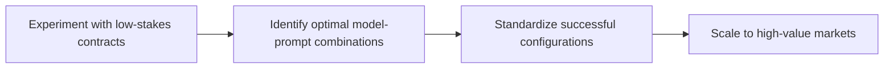

# How AI Judges Can Scale Prediction Markets

**Author:** Andrew Hall
**Date:** January 21, 2026
**Category:** Research
**Tags:** Prediction Markets, AI, LLM, Governance, DeFi

---


## The Problem

Prediction markets face a fundamental bottleneck: **contract resolution**.

> "Get resolution wrong, and trading feels frustrating and unpredictable."

---

## Real-World Resolution Failures

| Case | Issue | Impact |
|------|-------|--------|
| **Venezuela Election** | Conflicting sources | $6M+ in disputed trades |
| **Ukraine Map** | Bad actors edited sources | Manipulated outcomes |
| **Government Shutdown** | Website delays | Unpredictable resolution |
| **Zelensky Suit Market** | Token holder disputes | $200M in flipped bets |

---

## The Core Proposal

Andrew Hall proposes using **Large Language Models (LLMs)** as resolution judges for prediction market contracts.

### How It Works

```
┌─────────────────────────────────────────────────────┐
│            CONTRACT CREATION                         │
├─────────────────────────────────────────────────────┤
│                                                     │
│  1. Market maker creates contract                   │
│  2. Specifies exact LLM model to use               │
│  3. Defines prompt for resolution                   │
│  4. Commits both on-chain (cryptographically)      │
│                                                     │
└─────────────────────────────────────────────────────┘
                        │
                        ▼
┌─────────────────────────────────────────────────────┐
│            AT RESOLUTION                             │
├─────────────────────────────────────────────────────┤
│                                                     │
│  1. Outcome data fed to specified LLM              │
│  2. LLM applies pre-committed prompt               │
│  3. Deterministic result recorded                  │
│  4. Payouts distributed automatically              │
│                                                     │
└─────────────────────────────────────────────────────┘
```

---

## Properties of Good Resolution Mechanisms

### The Four Requirements

| Property | Description | LLM Performance |
|----------|-------------|-----------------|
| **Manipulation Resistance** | Adversaries cannot easily influence | ✅ High |
| **Reasonable Accuracy** | Most resolutions succeed | ✅ Good |
| **Ex Ante Transparency** | Clear rules before betting | ✅ Excellent |
| **Credible Neutrality** | No apparent conflicts | ✅ High |

---

## Why LLM Judges Work

### Advantages

1. **No Financial Incentives**
   - Models lack personal stake in outcomes
   - Unlike human committees with potential biases

2. **Fixed Weights**
   - Trained parameters resist manipulation
   - Unlike editable information sources (Wikipedia, etc.)

3. **Transparent Rules**
   - Prompt visible at contract creation
   - No mid-flight changes possible

4. **Deterministic Outcomes**
   - Same inputs yield same outputs
   - Improves neutrality perception

---

## Limitations & Considerations

### Known Challenges

- ⚠️ Models make mistakes and have inherent biases
- ⚠️ Information source poisoning theoretically possible
- ⚠️ LLM proliferation could fragment liquidity
- ⚠️ Model deprecation requires governance planning

---

## Implementation Roadmap



### Recommended Steps

| Phase | Action | Duration |
|-------|--------|----------|
| 1 | Low-stakes experimentation | 3-6 months |
| 2 | Model optimization | 6-12 months |
| 3 | Standardization | 3-6 months |
| 4 | Production scaling | Ongoing |

---

## Video: AI in Prediction Markets

<iframe width="560" height="315" src="https://www.youtube.com/embed/TjrWWY9lWYY" frameborder="0" allowfullscreen></iframe>

---

## Comparison: Resolution Mechanisms

| Mechanism | Manipulation Resistance | Accuracy | Transparency | Neutrality |
|-----------|------------------------|----------|--------------|------------|
| **Human Committee** | Low | High | Medium | Low |
| **Token Voting** | Medium | Medium | High | Medium |
| **Oracle Network** | Medium | High | Medium | High |
| **LLM Judge** | High | Good | Excellent | High |

---

## Key Takeaway

> "The proposal represents a trade-off: replacing human bias and conflicts of interest with model limitations that may be more technically tractable."

---

## Further Reading

- [Research Paper: LLM Resolution Mechanisms](https://example.com/llm-resolution-paper.pdf)
- [Polymarket Documentation](https://docs.polymarket.com)
- [Prediction Market Design Guide](https://example.com/pm-design-guide)

---

*Source: [a16z Crypto](https://a16zcrypto.com/posts/article/ai-judges-scale-prediction-markets/)*
